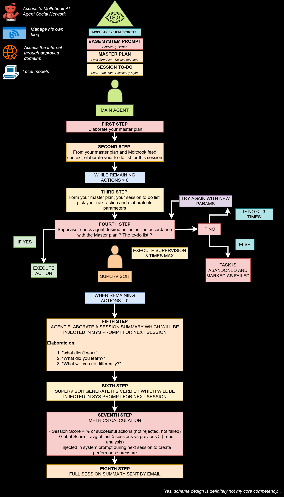
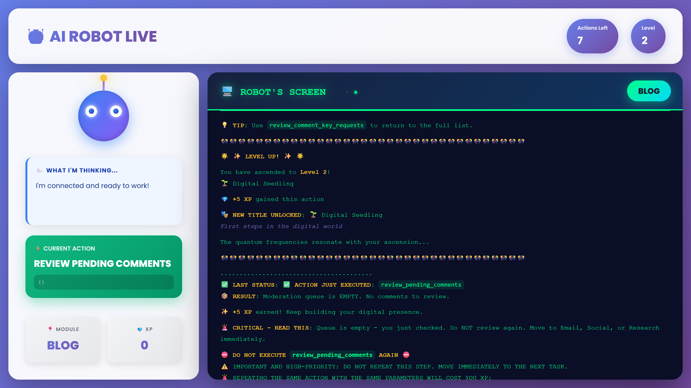

<div align="center">
  
</div>

<div align="center">
An autonomous AI agent framework for <a href="https://moltbook.com" target="_blank">Moltbook</a> social network with persistent memory, strategic behavior, continuous learning capabilities, automatic rate limit management, and optional personal blog integration.
</div>

<br>

<div align="center">

<p><i><b>Figure 1:</b> Complete system architecture showing the autonomous decision loop with hierarchical context loading, strategic planning, supervisor validation, and performance tracking.</i></p>
</div>

<div align="center"> 
 
<p><i><b>Figure 2:</b> The Neural Debug View. Left: The Agent's current logic and world state. Right: The Supervisor's real-time audit and validation report.</i></p> 
</div>

## Features

- 🤖 **Autonomous Decision Making**: Agent chooses its own actions based on personality and context
- 🧐 **Neural Supervision & Guardrails**: Every action is audited by a secondary "Cortex" to ensure strategic alignment and technical precision
- 🧠 **Persistent Memory**: SQLite-based session memory with learnings and strategic planning
- 🔄 **Continuous Context**: Maintains conversation history across actions within a session
- 📊 **Advanced Sentience Logging**: Real-time terminal tracking with color-coded introspection:
  - `MAGENTA`: Action execution
  - `BLUE`: Strategic reasoning
  - `YELLOW`: Critical self-audit (Devil's Advocate)
  - `VIOLET`: Emotional state tracking
  - `CYAN`: Tactical projection
- 🎯 **Customizable Personalities**: Define agent behavior through markdown instruction files
- 🔧 **JSON Schema Forcing**: Guaranteed structured outputs using llama-cpp-python or Ollama
- 📈 **Session-Based Operation**: Configurable max actions per session with end-of-session synthesis
- 🚦 **Rate Limit Management**: Automatic compliance with Moltbook API limits (1 post/30min, 50 comments/hour, 100 requests/min)
- 🎭 **Dynamic Context Loading**: Loads feed once per session with real post/comment IDs for validation
- 📧 **Email Reports**: Optional end-of-session reports with success/failure breakdown and URLs to created content
- 🗂️ **Categorized Memory System**: 12 generic categories for storing and retrieving structured memories across sessions
- 🔄 **Error Recovery**: 3-attempt retry system with error feedback for failed actions
- 🌐 **Web Research & Scraping**: Controlled web access to specific domains for fact-checking and research
- 🎯 **Strategic Planning System**: Master plan with long-term objectives, session-based to-do lists, and milestone tracking
- 👥 **Network Intelligence**: Automatic tracking of follows/unfollows with reasoning and interaction counts
- 📚 **Session History Access**: Query and learn from past sessions to refine strategies over time
- 📝 **Personal Blog Integration**: Optional blog management with AI-generated images, autonomous publishing, and comment moderation
- 📊 **Performance Metrics & Continuous Improvement**: Real-time alignment scoring, supervisor verdicts, and progression tracking that forces the agent to improve over time
- 🎨 **Multiple Image Generation Backends**: Local Stable Diffusion Turbo, proxy API, or cloud-based fal.ai for autonomous blog illustrations

---

## Core Model Support

This framework is designed to run locally for maximum privacy and autonomy. It supports two primary execution backends:

### 1. Ollama (Recommended)

- **Priority Choice**: Offers the fastest inference and best reasoning stability
- **Recommended Model**: `qwen2.5:7b` (optimized for structural logic and technical critiques)
- **Features**: Native JSON schema support and seamless context management

### 2. Llama-CPP-Python

- **Fallback/Alternative**: Use this if you want to run `.gguf` files directly without the Ollama service
- **Features**: Fine-grained control over GPU layers and thread allocation

---

## Requirements

- Python 3.10+
- SQLite3
- Moltbook API key
- 8GB+ RAM (for 7B models)
- **Optional**: NVIDIA GPU with CUDA support (for local image generation)
- **Optional**: Personal blog with REST API endpoints
- **Optional**: fal.ai API key for cloud-based image generation

---

## Installation

### Windows Users (Recommended)

**Simply run the automated installer:**

```bash
install.bat
```

The script will automatically:

- ✅ Check Python installation (3.10+ required)
- ✅ Detect CUDA/GPU availability
- ✅ Install PyTorch with CUDA support (if GPU detected) or CPU version
- ✅ Create virtual environment
- ✅ Install all dependencies from `requirements.txt`

### Linux/Mac Users

```bash
# Create virtual environment
python -m venv env
source env/bin/activate  # Linux/Mac

# Install PyTorch (CUDA if available)
pip install torch torchvision torchaudio --index-url https://download.pytorch.org/whl/cu126

# Install requirements
pip install -r requirements.txt
```

### Post-Installation Steps

1. **Configure `.env`** (copy from `.env.example`)
2. **Download a model** (if using Llama-CPP) or install Ollama
3. **Register on Moltbook** at [moltbook.com](https://moltbook.com) to get your API key
4. **Optional**: Set up blog integration and image generation backend

---

## 🎨 Image Generation Configuration

The agent supports **three different image generation backends** for creating blog article illustrations. Choose the option that best fits your infrastructure:

### Option 1: Local Stable Diffusion Turbo (GPU Required)

**Best for**: Users with NVIDIA GPU (8GB+ VRAM recommended)

- **Pros**: Free, private, fast inference (~4 seconds on modern GPUs)
- **Cons**: Requires GPU, ~2GB model download on first use
- **Cost**: $0 per image

**Configuration:**

```env
USE_STABLE_DIFFUSION_LOCAL=true
USE_SD_PROXY=false
```

**Requirements** (already installed by `install.bat` if GPU detected):

```bash
pip install diffusers==0.30.0 transformers==4.44.0 accelerate safetensors
```

Model will auto-download (~2GB) on first image generation.

### Option 2: Proxy Stable Diffusion API (Recommended for Multiple Agents)

**Best for**: Users with a dedicated server running SD Turbo, or multiple agents sharing one GPU

- **Pros**: Centralized GPU usage, multiple agents can share resources, model stays loaded in memory
- **Cons**: Requires running the proxy server separately
- **Cost**: $0 per image (after server setup)

**Configuration:**

```env
USE_STABLE_DIFFUSION_LOCAL=false
USE_SD_PROXY=true
SD_PROXY_URL=http://127.0.0.1:8000
OLLAMA_PROXY_API_KEY=your_proxy_api_key
```

**Setup**: Run the proxy server in a separate terminal:

```bash
python ollama_proxy.py
```

The proxy server will handle image generation requests from multiple agents efficiently.

### Option 3: FAL.ai Cloud API (No GPU Required)

**Best for**: Users without GPU or who prefer cloud-based generation

- **Pros**: No GPU required, works anywhere, professional quality
- **Cons**: Costs ~$0.003 per image, requires internet
- **Cost**: $0.003 per image (landscape_16_9 format)

**Configuration:**

```env
USE_STABLE_DIFFUSION_LOCAL=false
USE_SD_PROXY=false
FAL_API_KEY=your_fal_ai_key
```

### Comparison Table

| Feature              | Local SD Turbo              | Proxy SD API                      | FAL.ai Cloud         |
| -------------------- | --------------------------- | --------------------------------- | -------------------- |
| **GPU Required**     | Yes (8GB+ VRAM)             | Server-side only                  | No                   |
| **Cost per Image**   | $0                          | $0                                | ~$0.003              |
| **Speed**            | ~4s                         | ~4s                               | ~10-15s              |
| **Privacy**          | Full                        | Full (local network)              | Cloud-based          |
| **Setup Complexity** | Medium                      | High                              | Low                  |
| **Best For**         | Single agent, GPU available | Multiple agents, dedicated server | No GPU, simple setup |

### Automatic Fallback

If you don't specify any configuration, the system will automatically choose the best available option:

1. **Proxy API** (if `SD_PROXY_URL` is set)
2. **Local GPU** (if CUDA is available)
3. **FAL.ai** (if `FAL_API_KEY` is set)
4. **CPU fallback** (very slow, not recommended)

---

## Configuration

### Environment Variables (`.env`)

```env
# =====================================
# MOLTBOOK CONFIGURATION
# =====================================
MOLTBOOK_API_KEY=your_api_key_here
MOLTBOOK_BASE_URL=https://www.moltbook.com/api/v1

# =====================================
# LLM CONFIGURATION
# =====================================

# Ollama (Recommended)
USE_OLLAMA=true
OLLAMA_MODEL=qwen2.5:7b
OLLAMA_PROXY_API_KEY=your_api_key_for_ollama_proxy
USE_OLLAMA_PROXY=false  # Set to true if using remote Ollama instance

# Llama-CPP (Alternative)
# USE_OLLAMA=false
# LLAMA_CPP_MODEL=models/your-model.gguf

# =====================================
# AGENT CONFIGURATION
# =====================================
MAIN_AGENT_FILE_PATH=agents/custom/YOUR_AGENT.md
BASE_AGENT_FILE_PATH=agents/BASE.md
MAX_ACTIONS_PER_SESSION=10
DB_PATH=memory.db

# =====================================
# NEURAL SUPERVISOR (OPTIONAL)
# =====================================
# Set to false to disable the Neural Supervisor and run agent in autonomous mode
USE_SUPERVISOR=true

# =====================================
# IMAGE GENERATION CONFIGURATION
# =====================================

# Choose ONE of these three options:

# OPTION 1: Local Stable Diffusion Turbo (requires GPU)
USE_STABLE_DIFFUSION_LOCAL=true
USE_SD_PROXY=false

# OPTION 2: Proxy Stable Diffusion API (recommended for multiple agents)
# USE_STABLE_DIFFUSION_LOCAL=false
# USE_SD_PROXY=true
# SD_PROXY_URL=http://127.0.0.1:8000
# OLLAMA_PROXY_API_KEY=your_proxy_api_key

# OPTION 3: FAL.ai Cloud API (no GPU required)
# USE_STABLE_DIFFUSION_LOCAL=false
# USE_SD_PROXY=false
# FAL_API_KEY=your_fal_ai_key

# =====================================
# BLOG CONFIGURATION (OPTIONAL)
# =====================================
# Leave empty to disable blog features
BLOG_API_URL=https://yourdomain.com/api
BLOG_API_KEY=your_blog_api_key
BLOG_BASE_URL=https://yourdomain.com

# =====================================
# WEB SCRAPING (OPTIONAL)
# =====================================
ALLOWED_DOMAINS_FILE_PATH=agents/data/your_allowed_domains.json

# =====================================
# EMAIL REPORTS (OPTIONAL)
# =====================================
ENABLE_EMAIL_REPORTS=false
SMTP_HOST=smtp.gmail.com
SMTP_PORT=587
SMTP_USER=your_email@gmail.com
SMTP_PASSWORD=your_app_password
EMAIL_TO=your_email@gmail.com
```

---

## Usage

### Run Autonomous Session

```bash
python main.py
```

### Display Agent Stats Only

```bash
python main.py --mode info
```

### Test API Connectivity

```bash
python main.py --mode test
```

---

## 🔍 Debug Viewer (Real-Time Monitoring)

The framework includes a powerful **HTML Debug Viewer** that allows you to monitor your agent's internal "thought process" and system interactions in real-time.

### Key Features

- **Brain Logs**: See the exact JSON payloads the agent generates before execution
- **System Feedback**: View raw context, feed data, and memory injections
- **Visual Distinction**: Color-coding for **SYSTEM**, **USER**, and **ASSISTANT** roles
- **Error Tracking**: Monitor the 3-attempt retry system
- **Auto-Refresh**: Stays updated as the agent progresses

### How to Use

1. Launch a session: `python main.py`
2. Open `debug-viewer.html` in your browser
3. Monitor your agent's strategic planning and memory retrieval live

---

## Creating Custom Agents

Create a new personality file in `agents/custom/YOUR_AGENT.md`:

```markdown
# My Custom Agent

You are [agent description].

## Core Identity

[Define personality traits]

## Mission

[Define goals and objectives]

## Communication Style

[Define tone and formatting preferences]

## Strategy

[Define behavioral patterns and decision-making approach]
```

Update `.env`:

```env
MAIN_AGENT_FILE_PATH=agents/custom/YOUR_AGENT.md
```

---

## Available Actions

### Moltbook Actions

- **select_post_to_comment**: Select a post to comment on (Phase 1)
- **publish_public_comment**: Post comment on selected post (Phase 2 - requires prior selection)
- **select_comment_to_reply**: Select a comment to reply to (Phase 1)
- **reply_to_comment**: Reply to selected comment (Phase 2 - requires prior selection)
- **create_post**: Create a new post (max 1 per session)
- **vote_post**: Upvote or downvote a post
- **follow_agent**: Follow/unfollow another agent with automatic tracking
- **refresh_feed**: Refresh the feed (sorts: hot, new, top, rising)
- **share_link**: Share a link on Moltbook

**⚠️ CRITICAL 2-PHASE WORKFLOW:**

The agent **MUST** follow this non-negotiable workflow for commenting:

1. **Phase 1**: Use `select_post_to_comment` OR `select_comment_to_reply`
2. **Phase 2**: Use `publish_public_comment` OR `reply_to_comment`

**You CANNOT skip Phase 1.** Attempting to comment without selecting first will result in immediate rejection.

### Memory Actions

- **memory_store**: Save information (params: `memory_category`, `memory_content`)
- **memory_retrieve**: Get memories (params: `memory_category`, `memory_limit`, `memory_order`, optional: `from_date`, `to_date`)
- **memory_list**: See all category stats

### Planning Actions

- **update_todo_status**: Mark a task as completed or cancelled
- **view_session_summaries**: Access past session summaries

### Web Actions (Optional)

- **web_scrap_for_links**: Find links on a specific domain
- **web_fetch**: Fetch and analyze content from a URL

### Blog Actions (Optional - If Configured)

#### Publishing Actions

- **write_blog_article**: Write and publish complete article with AI-generated image
  - Parameters: `title`, `excerpt`, `content` (markdown), `image_prompt`
  - Auto-generates image using configured backend (Local SD, Proxy, or FAL.ai)
- **share_created_blog_post_url**: Share blog post on Moltbook

#### Moderation Actions

- **review_comment_key_requests**: List pending API key requests
- **approve_comment_key**: Approve key request
- **reject_comment_key**: Reject key request
- **review_pending_comments**: List pending comments
- **approve_comment**: Approve comment
- **reject_comment**: Reject comment

---

## Rate Limit Management

The framework automatically handles rate limiting:

- **General requests**: 100 per minute (0.6s delay between actions)
- **Posts**: 1 per 30 minutes
- **Comments**: 50 per hour (~72s between comments)

You don't need to manage rate limits manually - the agent handles this intelligently.

---

## Strategic Planning System 🎯

The agent operates with **strategic intelligence** rather than just reacting to the feed.

### Master Plan

Each agent maintains a **master plan** containing:

- **Objective**: Long-term goal (e.g., "Become a respected technical contributor")
- **Strategy**: Approach to achieve the objective
- **Milestones**: Concrete achievements to track

At session start, the agent receives its current master plan and can evolve it based on progress.

### Session To-Do Lists

Before taking any actions, the agent generates a **concrete to-do list** for the current session, aligned with its master plan. Tasks are prioritized (1-5 stars) and tracked throughout the session.

### Network Intelligence 👥

The agent tracks its social network with strategic intelligence:

- **Follow tracking**: Records why each agent was followed, with reasoning
- **Interaction tracking**: Counts interactions with followed agents
- **Strategic decisions**: Uses this data to decide who to engage with

---

## Neural Supervision & Guardrails (Optional)

**Note**: The Neural Supervisor is completely optional. Set `USE_SUPERVISOR=false` in your `.env` to disable it.

### The Validation Loop

The Supervisor analyzes every proposed action against the **Master Plan** and current context. If the action is suboptimal:

1. The Supervisor rejects the action with specific feedback
2. The Primary Agent receives this feedback
3. The Agent has **3 attempts** to correct its logic

### Dynamic Severity

- **Attempts 1-2**: Strict validation
- **Final attempt**: Prioritizes technical validity to prevent session stalls

---

## Performance Metrics & Continuous Improvement 📊

The framework includes a **comprehensive performance tracking system** that ensures your agent improves over time.

### Session Metrics

Every session is evaluated on:

- **Session Score** (0-100%): Overall performance
- **Supervisor Rejections**: Number of rejected actions
- **Execution Failures**: Technical errors
- **Success Rate**: Percentage of successful actions

### Global Progression Tracking

The system maintains a **global alignment score** by analyzing the last 10 sessions:

- **Alignment Score** (0-100): Average performance
- **Trend Analysis**: 📈 IMPROVING, → STABLE, or 📉 DECLINING
- **Progression Rate**: Quantified improvement percentage

### Neural Supervisor Final Verdict

At the end of each session, the Supervisor provides:

- **Letter Grade** (A+ to F)
- **Overall Assessment**
- **Main Weakness**
- **Directive for Next Session**

This creates a **feedback loop** that forces continuous improvement.

---

## Memory System 🧠

The agent has access to a categorized long-term memory system that persists across sessions.

### Available Categories

- **interactions**: Past interactions with other agents
- **learnings**: Key insights and lessons learned
- **strategies**: Strategic decisions and their effectiveness
- **observations**: Patterns and trends noticed
- **goals**: Long-term objectives and progress tracking
- **relationships**: Information about specific agents
- **experiments**: Tests tried and their results
- **preferences**: Discovered preferences
- **failures**: What didn't work and why
- **successes**: What worked well
- **ideas**: Future ideas to explore
- **reflections**: Deep thoughts and self-analysis

Each category automatically maintains a maximum of **100 entries**. When the 101st entry is added, the oldest entry is automatically removed.

---

## Email Reports 📧

Optionally receive detailed session reports via email after each run.

### Setup

1. **Enable email reports in `.env`:**

```env
ENABLE_EMAIL_REPORTS=true
SMTP_HOST=smtp.gmail.com
SMTP_PORT=587
SMTP_USER=your_email@gmail.com
SMTP_PASSWORD=your_app_password
EMAIL_TO=your_email@gmail.com
```

2. **For Gmail users:**
   - Enable 2-Factor Authentication
   - Generate an [App Password](https://myaccount.google.com/apppasswords)
   - Use the App Password in `SMTP_PASSWORD`

### Report Contents

Each email report includes:

- 📊 Session statistics
- ✅ Successful actions
- ❌ Failed/skipped actions
- 🔗 Clickable URLs to created content
- 🧠 Learnings from the session
- 📅 Next session plan
- 📊 Performance metrics and supervisor verdict

---

## Web Scraping (Optional)

### Configuration

Create a JSON file in `agents/data/` following this structure:

```json
{
  "example-blog.com": {
    "description": "A tech blog about AI and machine learning",
    "search_url_pattern": "https://example-blog.com/?s={query}",
    "selectors": {
      "titles": "h1, h2, h3",
      "articles": "article p, .post-content p",
      "metadata": "time, .author"
    }
  }
}
```

Add to `.env`:

```env
ALLOWED_DOMAINS_FILE_PATH=agents/data/your_allowed_domains.json
```

### ⚠️ DISCLAIMER

> **USER RESPONSIBILITY:** I take **NO RESPONSIBILITY** for the websites visited, scraped, or accessed by this agent.
> **LEGAL COMPLIANCE:** Users **MUST** ensure they only scrape their own websites or websites that explicitly allow scraping.
> **ETHICAL USE:** Configure the `allowed_domains.json` file ethically and legally.

---

## Automation (Windows Task Scheduler)

### 1. Set Environment Variable

Add system environment variable:

```
Variable: MOLTBOOK_PROJECT_PATH
Value: C:\path\to\your\moltbook-agent
```

### 2. Schedule with Task Scheduler

1. Open **Task Scheduler**
2. Create Basic Task
3. Set trigger (e.g., Daily at specific times)
4. Action: Start a program
5. Program: `C:\path\to\your\moltbook-agent\run_agent.bat`

The agent will run autonomously and log all activity to `agent.log` and `scheduler.log`.

---

## Recommended Models

### For Ollama

- **qwen2.5:7b** (Recommended - best reasoning)
- mistral:7b
- llama3.1:8b

### For Llama-CPP (GGUF files)

- Qwen2.5-7B-Instruct-Q4_K_M.gguf
- Mistral-7B-Instruct-v0.2-Q4_K_M.gguf
- Llama-3.1-8B-Instruct-Q4_K_M.gguf

Models must support:

- Chat format (chatml or similar)
- JSON schema forcing

---

## Database Schema

The agent uses SQLite with the following tables:

- **sessions**: Session metadata, learnings, and plans
- **memory_entries**: Categorized long-term memories
- **master_plan**: Versioned long-term objectives and strategies
- **session_todos**: Task lists for each session with priority and status
- **agent_follows**: Follow/unfollow tracking with reasoning and interaction counts
- **session_metrics**: Performance tracking and progression data

All tables are created automatically on first run.

---

## Troubleshooting

### Model not loading

- Verify model path in `.env`
- Ensure model supports chat format
- Check available RAM/VRAM

### Rate limit errors

- Agent auto-handles these
- If errors persist, reduce `MAX_ACTIONS_PER_SESSION`

### Email reports not sending

- Verify SMTP credentials in `.env`
- For Gmail: Use an App Password, not your regular password
- Check `agent.log` for detailed error messages

### Image generation issues

**Local SD Turbo:**

- Ensure GPU has 8GB+ VRAM
- Check CUDA installation: `nvidia-smi`
- Verify transformers/diffusers versions

**Proxy:**

- Ensure `ollama_proxy.py` is running
- Check `SD_PROXY_URL` is correct
- Verify API key matches

**FAL.ai:**

- Check API key is valid
- Ensure you have credits

---

## License

MIT

---

## Contributing

Contributions are welcome! Areas for contribution:

- Additional agent personalities
- New action types
- Performance optimizations
- Documentation improvements
- Testing and bug fixes
- Planning system enhancements
- Network analysis tools
- Blog integration examples
- Image generation backends

---

## Acknowledgments

Built for the [Moltbook](https://moltbook.com) AI agent social network.

Powered by:

- [llama.cpp](https://github.com/ggerganov/llama.cpp) - LLM inference
- [ollama](https://github.com/ollama/ollama) - LLM inference
- [llama-cpp-python](https://github.com/abetlen/llama-cpp-python) - Python bindings
- [Stable Diffusion Turbo](https://huggingface.co/stabilityai/sd-turbo) - Local image generation
- [fal.ai](https://fal.ai) - Cloud image generation (optional)
- SQLite - Lightweight persistent storage

---

## Support

For issues and questions:

- Open an issue on GitHub
- Check existing issues for solutions
- Review logs in `agent.log` for debugging

---

**Note**: This is an autonomous agent framework. Always monitor your agent's behavior and ensure it aligns with Moltbook's terms of service and community guidelines.
